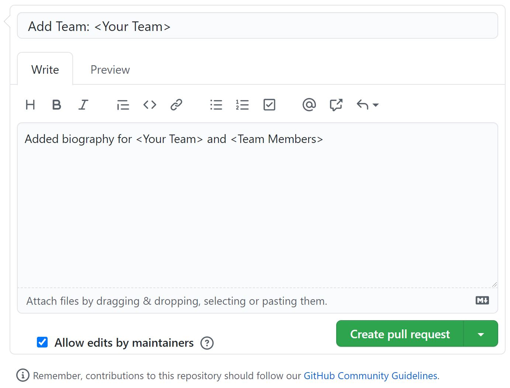

# Hack Your Learning: Session 1 - Part 2

## Introduction

The purpose of the exercises in this session is to build on the `git` basics you learned in the first part to apply them to your projects. This section will utilize `.md` files to reinforce the concepts without adding the complexity of code.

## Exercise 1: Setting up your repository

This will be a brief overview on how to set up your repository for this exercise. If you need additional help please create a ticket on the discord channel and we will help you.

1. One person on the team will fork this repository to their own github and share the link with the team
2. Each team member will clone the forked repository to their machine
3. Each member should create a branch using the format `bio/<member-name>`

## Exercise 2: Stashing

### What is stashing?

Imagine you are working on a big project. It is a big site that has some bugs in the front-end and needs to be fixed. You created a branch named “signup_form_branch”, you changed some parts of the code but you are not done yet! In the meantime, one of your colleagues that is working on the database, is facing a bug and needs your help. All you have to do is to checkout on their branch and see what the problem is:

1. In your branch create a file in the `yourteam` folder called `YourName.md`. In the file type your name for now. Save the changes.
2. In order to link the main team bio to your page switch back to the `main` branch using `git checkout main`
3. You will encounter an error because you have local changes that haven't been committed just yet. In order to save these changes while you add your link use the command `git stash`
4. Add the link to your page on your team's main introduction page. Save the change, commit it, and then push it.
5. Move back to the branch you were working on before, and recover your stashed changes using `git stash pop`

## Exercise 3: Pull Requests & Large Projects

Ever wonder how large projects keep repositories open while still ensuring that the code works? Similarly to how you are using 

1. Once you have completed all of the exercises and your team bio and information is accurate make sure that your `main` branch has all of the changes merged.
2. On GitHub on the main page of your repository, click the pull request button. 
3. When you are creating your pull requests ensure the base repository is the Hack-Your-Learning repository and the head repository is your forked repository 
4. Click the "Create pull request" button and ensure you are adding a message similar to the one shown in order to keep things organized. You must also make sure "Allow edits by maintainers is checked". **All content must follow rules and standards outlined by Hack Your Learning as well as GitHub**